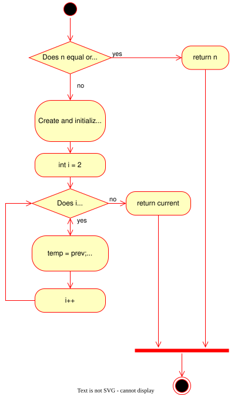
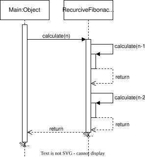
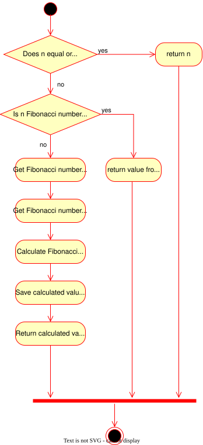

<h1>Fibonacci</h1>
This project demonstrates different approaches for getting Fibonacci element by
its ordinal number.
Main purpose is to learn following topics:

- Recursion
- Dynamic Programming
- UML diagrams
- Space Complexity
- Time Complexity

<h2> Iterated Method </h2>

Calculating Fibonacci number using simple for loop.

- Space complexity is: O(1)
- Time complexity is: O(n)
- Activity Diagram:

<h2> Recursive Method </h2>

Calculating Fibonacci number using recursion.

- Space complexity is: О(2^n)
- Time complexity is: O(n)
- Sequence Diagram:

<h2> Dynamic Method </h2>

Calculating Fibonacci number using dynamic programming.

- Space complexity is: О(n)
- Time complexity is: O(n)
- Activity Diagram:

